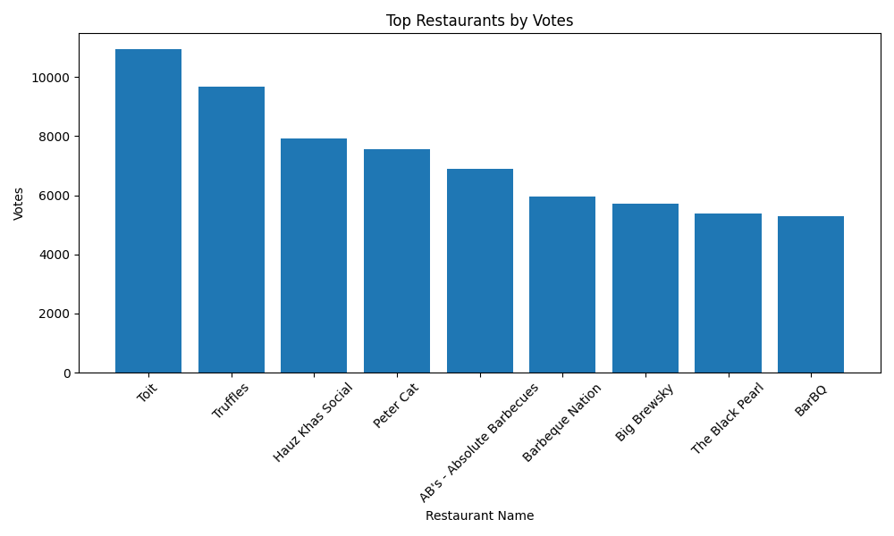

# COGNIFYZ - DATA ANALYSIS LEVEL 2 TASK 3

## 📌 Project Overview

This project focuses on analyzing restaurant popularity using customer voting data. The objective is to identify restaurants with the highest customer engagement based on vote counts and understand customer preferences.

---

## 🛠️ Tools & Technologies Used

- Python
- Pandas
- Matplotlib

---

## 🎯 Objective

Analyze restaurant voting patterns and identify the most popular restaurants using customer vote data.

---

## ⚙️ Steps Performed

1. Loaded the dataset using pandas
2. Removed missing values from important columns
3. Selected restaurants with highest votes
4. Identified top 10 restaurants based on votes
5. Created visualization using bar chart

---

## 📊 Data Visualization

### 🔹 Top Restaurants by Votes

---

## 🔍 Key Insights

- Some restaurants receive significantly higher customer engagement
- High vote counts indicate strong customer popularity
- Popular restaurants may provide better service and food quality
- Customer reviews and ratings strongly influence voting behavior

---

## 💼 Business Recommendations

- Restaurants should focus on improving customer experience
- Businesses can use vote analysis for marketing strategies
- Highly voted restaurants can be used as benchmark models
- Customer feedback plays an important role in restaurant growth

---

## ✅ Conclusion

Vote analysis helps understand restaurant popularity and customer engagement patterns. This analysis supports better business decisions and customer satisfaction improvement.