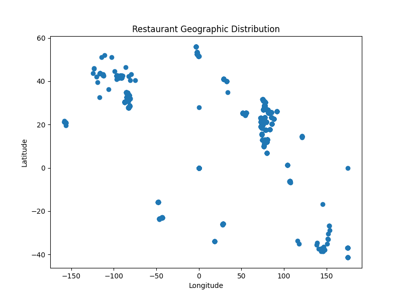

# COGNIFYZ - DATA ANALYSIS LEVEL 2 TASK 3

## 📌 Project Overview

This project focuses on geographic analysis of restaurant locations using latitude and longitude data. The objective is to visualize restaurant distribution patterns.

---

## 🎯 Objective

- Analyze restaurant locations
- Visualize geographic distribution
- Identify location patterns

---

## 🛠 Technologies Used

- Python
- Pandas
- Matplotlib

---

## 📂 Files Included

- dataset.csv
- geographic_analysis.py
- restaurant_locations.png
- README.md

---

## ⚙ Steps Performed

1. Loaded dataset using pandas
2. Extracted latitude and longitude columns
3. Removed missing values
4. Created scatter plot visualization
5. Saved geographic distribution graph

---

## 📊 Data Visualization

### Restaurant Geographic Distribution

---

## 🔍 Key Insights

- Restaurants are concentrated in specific regions
- Geographic visualization helps identify business hotspots
- Location analysis supports expansion strategies

---

## ✅ Conclusion

Geographic analysis helps understand restaurant distribution and regional concentration patterns. This analysis can support location-based business decisions.